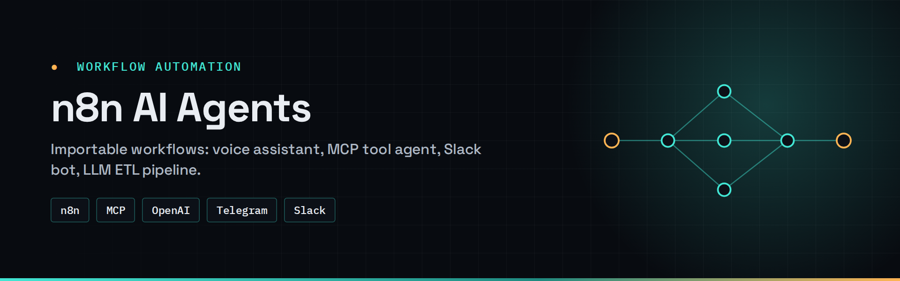
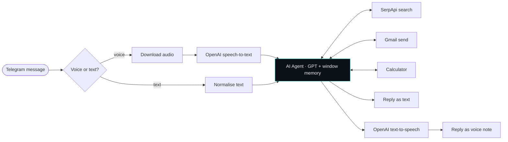

<div align="center">



# n8n AI Agents

**Importable, production-style n8n workflows: a voice assistant, an MCP tool-calling agent, a Slack bot and an LLM-powered ETL pipeline.**

[](https://github.com/Hariharan17194/n8n-ai-agents/actions/workflows/validate-n8n.yml)


[](LICENSE)

</div>

---

## ✦ Workflows

| # | Workflow | What it does | Key nodes | Demo |
|---|---|---|---|---|
| 01 | [**Jarvis voice assistant**](workflows/01-jarvis-voice-assistant) | Telegram bot that takes voice or text, thinks with memory + tools, replies in **text and synthesized voice** | Telegram · OpenAI STT/TTS · AI Agent · SerpApi · Gmail · Calculator | [▶ video](https://github.com/Hariharan17194/n8n-ai-agents/releases/download/demos/jarvis-voice-assistant-demo.mp4) |
| 02 | [**MCP tool-calling agent**](workflows/02-mcp-agent) | Chat agent that calls tools exposed by a custom **MCP server** — search, Calendar, Sheets, Gmail | MCP Client · AI Agent · Simple Memory | [▶ video](https://github.com/Hariharan17194/n8n-ai-agents/releases/download/demos/mcp-agent-demo.mp4) |
| 03 | [**Slack recipe bot**](workflows/03-slack-recipe-bot) | Replies to a dish name with its ingredient list — curated table first, LLM fallback | Slack Trigger · Data Tables · LLM Chain | [▶ video](https://github.com/Hariharan17194/n8n-ai-agents/releases/download/demos/slack-recipe-bot-demo.mp4) |
| 04 | [**AI ETL pipeline**](workflows/04-ai-etl-pipeline) | Upload a messy CSV → LLM cleans/validates rows → split into clean output files | Form Trigger · Extract from File · LLM Chain · Code | — |

## ✦ Architecture — Jarvis voice assistant



## ✦ Import a workflow

1. In n8n: **Workflows → Import from File** → pick `workflows/<name>/workflow.json`.
2. Open every node showing a ⚠️ and attach **your own** credentials (OpenAI, Telegram, Slack, Google, SerpApi).
3. Follow that workflow's `README.md` for any extra setup (Slack app scopes, Data Table seed, MCP server URL).
4. Activate.

> **No secrets are committed.** CI fails the build if a workflow export contains credential values or hard-coded API keys.

## ✦ Repository layout

```text
workflows/
├── 01-jarvis-voice-assistant/
│   ├── workflow.json
│   ├── README.md
│   └── screenshot.png
├── 02-mcp-agent/
├── 03-slack-recipe-bot/
└── 04-ai-etl-pipeline/
    └── workflow.json
```

## ✦ Requirements

- n8n ≥ 1.x (self-hosted or cloud) — Data Tables needed for workflow 03
- API credentials for the services each workflow uses

## ✦ License

[MIT](LICENSE) © 2026 Hariharan Padmanabhan
