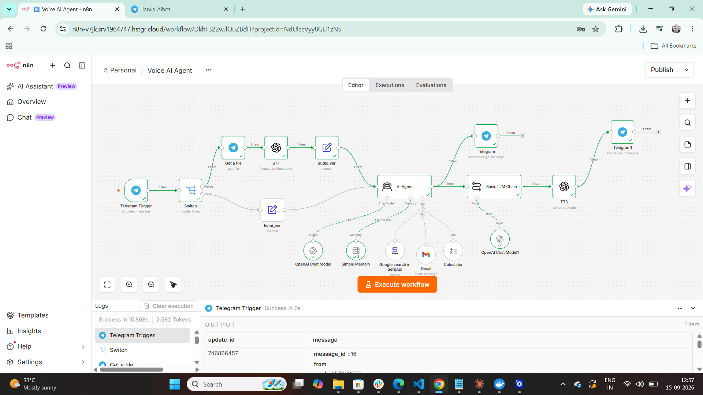

# 01 · Jarvis voice assistant (Telegram)

A multi-modal assistant that runs entirely inside Telegram. Send a **voice note or a text message**; it transcribes audio, reasons with memory and tools, and replies **twice** — as text and as a synthesized voice note.

▶ [Watch the demo (1 min)](https://github.com/Hariharan17194/n8n-ai-agents/releases/download/demos/jarvis-voice-assistant-demo.mp4)

## Flow

1. **Telegram Trigger** receives the message → **Switch** routes by type.
2. Voice → **Get a file** → **OpenAI speech-to-text**. Text → passed straight through.
3. **AI Agent** (OpenAI chat model + window memory) decides what to do, with tools:
   - **SerpApi** — live Google search
   - **Gmail** — send an email on request
   - **Calculator** — quick maths
4. Reply is sent as **text**, then converted by **OpenAI text-to-speech** and sent as a **voice note**.

## Setup

1. Import `workflow.json` into n8n.
2. Create credentials: Telegram bot token (from @BotFather), OpenAI, SerpApi, Gmail OAuth2.
3. Attach them to the nodes marked ⚠️, then activate the workflow and message your bot.
