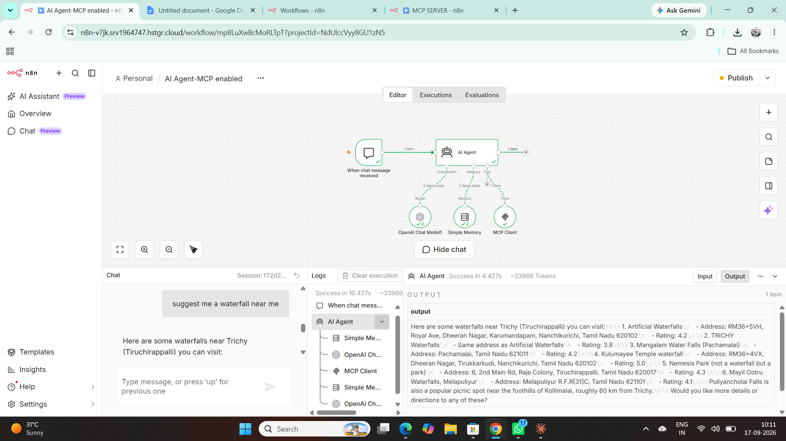
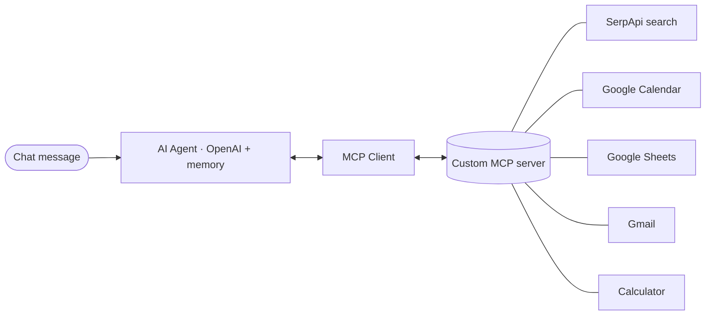

# 02 · MCP tool-calling agent

A chat-triggered n8n AI agent that connects to a **custom MCP server** exposing Google & Amazon search (SerpApi), Google Calendar, Google Sheets, Gmail and a calculator as tools — with conversation memory and OpenAI as the LLM.

▶ [Watch the demo](https://github.com/Hariharan17194/n8n-ai-agents/releases/download/demos/mcp-agent-demo.mp4)

## Flow

> 📦 **Workflow export coming soon** — `workflow.json` will be added here.
