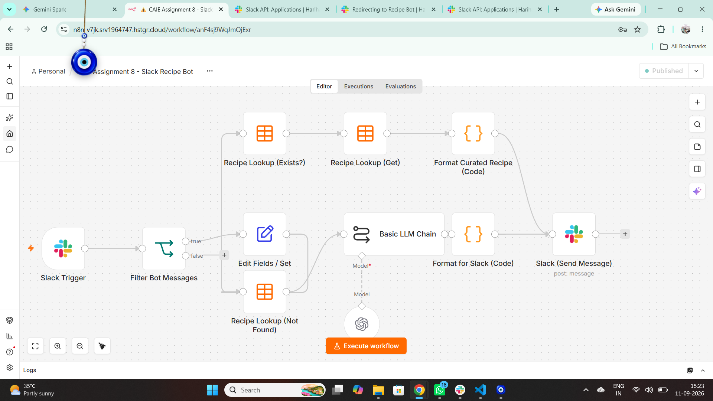
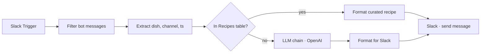

# 03 · Slack recipe bot

Type a dish name in Slack (e.g. `Chicken Biryani`) and the bot replies with its ingredient list — from a **curated n8n Data Table** if it knows the dish, otherwise **generated by OpenAI**.

▶ [Watch the demo](https://github.com/Hariharan17194/n8n-ai-agents/releases/download/demos/slack-recipe-bot-demo.mp4)

## Flow

## Setup notes

- Slack app scopes: `chat:write`, `channels:history` (+ `groups/im/mpim:history` for private channels and DMs). Event subscription: `message.channels`.
- **Gotcha:** turn **Socket Mode off** before setting the Event Subscriptions Request URL — with Socket Mode on, Slack silently ignores the URL.
- Data Table `Recipes` columns: `recipe_key` (lowercase), `recipe_name`, `ingredients` (Slack markdown).

> 📦 **Workflow export coming soon** — `workflow.json` and `data/recipes-seed.json` will be added here.
