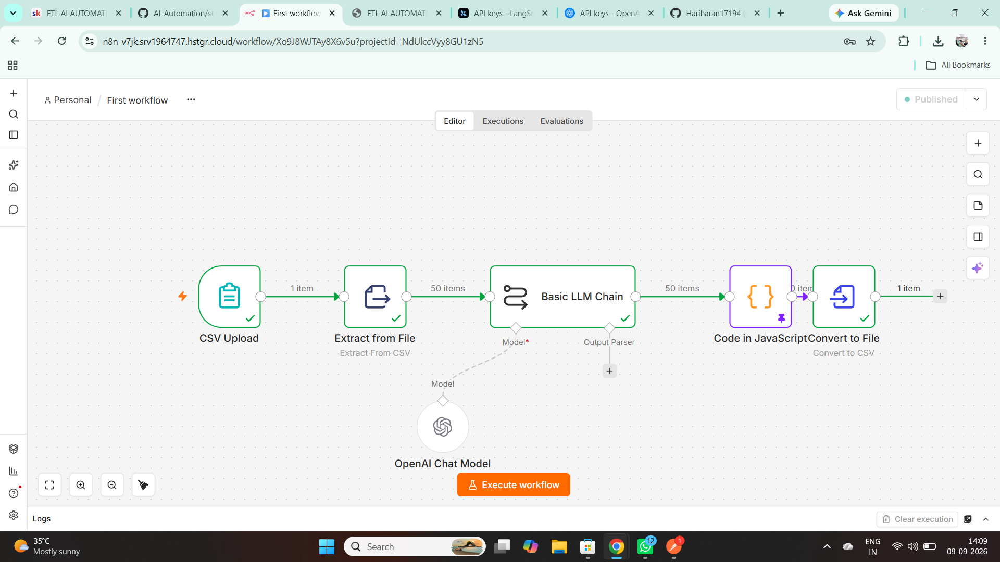
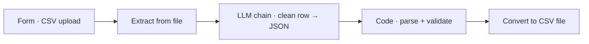

# 04 · AI ETL pipeline

Upload a messy student-enrollment CSV through an n8n form; an LLM cleans and validates **each row** (names, emails, phone numbers, dates, fee status) and a Code node assembles a clean CSV for download.

## Flow

## Cleaning rules (enforced in the prompt)

| Field | Rule |
|---|---|
| Name, City | Title Case · empty city → `UNKNOWN` |
| Email | invalid → `INVALID_EMAIL` |
| Phone | < 10 digits → `MISSING` |
| Course | one of Python · Machine Learning · Data Science |
| Fee_Paid | yes/no → `true`/`false` |
| Enrolled_Date | → `YYYY-MM-DD` |

## Setup

Import `workflow.json`, attach an OpenAI credential, activate, and open the form's production URL.
